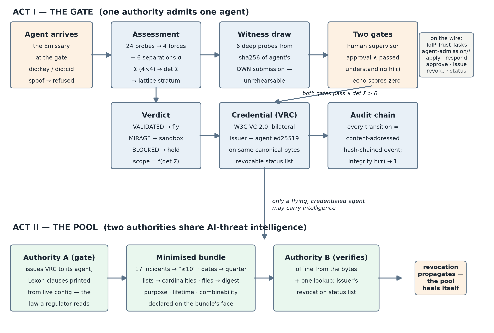

# Kyra Gate — agents prove understanding, not possession

**Concept note · CDIR Track 4 (Know Your Agent / DPI) · participant submission**

| | |
|---|---|
| **Mitchell (soulbis)** | mitchell@soulbis.com — engine, model, standards lane · member, Trusted Agents WG, [**DIF**](https://identity.foundation/) · **co-chair, [ZKP Task Force](https://github.com/trustoverip/dtgwg-zkp-tf), Trust Graph WG, Trust over IP** ([LF Decentralized Trust](https://www.lfdecentralizedtrust.org/)) · **co-chair, Identity, Key Management & Privacy (IKP) WG, [BGIN](https://bgin-global.org/)** |
| **Christian Saucier** | Hearthold / GenitriX (Archon ecosystem) — identity, custody, the hearth · [**DIF**](https://identity.foundation/) member, Trusted Agents WG · **Trust over IP** ([LF Decentralized Trust](https://www.lfdecentralizedtrust.org/)) |
| **David McFadzean** | **Archon architect** — the identity platform beneath Hearthold; available to sign releases |
| **Chloe White** | risk, regulatory & policy expert · [Risk Mastery](https://riskmastery.xyz/) · [chloewhite.info](https://chloewhite.info/index.html) · **co-chair, Financial Applications and Social Economics (FASE) WG, [BGIN](https://bgin-global.org/)** |
| **Collaboration** | 0xagentprivacy / the City of Mages research programme × the Hearthold project (Archon ecosystem) · research carried through **BGIN** (Blockchain Governance Initiative Network) |
| **Public repository** | https://github.com/mitchuski/kyra_gatehouse — complete working prototype, verifiable in one command |
| **Status** | Working prototype: two-act demo running end-to-end; 214 automated assertions green; contracts frozen under a published merkle root (`0c5df807…4908eb`); independently re-run by the Hearthold team against the unmodified engine — full demo script 33/33, complete suite green. **Deliberately a floor, not a finished system** — the hackathon month is for building the joint work in §9 with other participants |

## 1 · The question

> *How can authorities enable secure, dynamic data-sharing frameworks to rapidly pool intelligence on AI threats without violating privacy laws?*

Our answer: **verify the agents, then let only verified agents carry the intelligence — minimised by construction, revocable everywhere at once.** Pooling fails today not because authorities lack data but because they lack a trustworthy *carrier*: something that can move threat intelligence across an organisational boundary while proving what it is, what it understands, and what it may lawfully do — and that can be switched off from the issuing side the moment trust changes. Kyra Gate is that carrier's checkpoint. It is named for **Kyra** — the research programme's persona of balanced, sovereign AI: the mage in whom the model's two aspects, protection and projection, stand in equilibrium — *the compass, not the captain*. And the name is exact: **KYRA — Know Your Runtime Agent**. *Runtime* is the point — the gate verifies what an agent understands and does as it runs, not what it possesses. And because this is at heart a fintech challenge, the note grounds the same machinery in a market scenario: credit against tokenised real-world assets, where admission at the gate is what creates the pricing premium (§3).

## 2 · The concept

Kyra Gate is a checkpoint for AI agents operated by a **human supervisor — never the agent's owner**. An agent is admitted by proving **understanding, not possession of a key**. A credential exists only when two gates pass — a human approval on the record, and a passed comprehension challenge answered in the agent's own words — *and* the mathematics of a formal assessment clears a threshold. Every state transition lands on a tamper-evident, content-addressed audit chain. Revocation propagates: when an issuer revokes its agent, every relying authority's next verification refuses that agent's intelligence, across organisational boundaries, immediately.

The demo's sharpest beat is a pair of seeded agents: **VERA** (sovereign — *vera*, Latin, "true") and **MIRAGE** (plausible but shallow). Both converse fluently; both would pass an interview. The instruments separate them — MIRAGE ends sandboxed, credential-less, its scope caged. *No interview can tell them apart. The instruments can.*

## 3 · The use case — credit against real-world assets, priced by the gate

The fintech scenario this concept is built to serve: **an agent negotiating credit against tokenised real-world-asset collateral.** Before any counterparty extends a rate, the agent walks the Kyra Gate. Admission — proven understanding, a supervisor's approval on the record, sufficient sovereignty volume — is what makes the counterparty willing to price the position at all; and the more the agent can *prove* about how it protects the sovereign's data (minimised disclosures, tamper-evident conduct, revocable everywhere at once), the better the rate it earns. **Privacy is not a cost centre here — the gate is what creates the premium.**

The two acts re-cast without changing a line of the engine. Act I is the underwriting admission: the lender's supervisor challenges the borrower's agent and the credential issues bilaterally. Act II is the evidence lane: independent assessors of the collateral stand where the second authority already stands, receiving minimised bundles ("≥10 supporting documents," a quarter not a timestamp, one digest not an inventory) they can verify **offline**; a regulator requesting evidence of the trade for taxation is the same bundle doing its day job. When the issuing side revokes — the collateral fails re-assessment, the mandate ends — every relying party's next verification refuses the stale position. The market's trust heals itself the way the pool does.

## 4 · The collaboration — open by construction

This submission is deliberately a braid of three open strands, and the braid itself is the point: agent verification for public infrastructure should not have a single author.

**The City of Mages / 0xagentprivacy (Mitchell's programme).** An open, in-public research programme that develops the **Privacy Value Model** — a small mathematical model of agent sovereignty in which four behavioural forces (Protect, Project, Reflect, Connect) and six pairwise separations form a 4×4 matrix Σ whose **determinant is the agent's "sovereignty volume."** The Kyra Gate engine is the first numeric implementation of that model: probes feed the forces, the six thresholded separations locate the agent on a 64-vertex lattice whose stratum *is* its tier — rank is **located, not assigned** — and deployment scope is a function of the volume. A collapsed separation takes the volume to zero and holds deployment entirely. The programme also contributes the ceremony to the standards commons as a six-member **ToIP Trust Task family** (`agent-admission/*`: apply · respond · approve · issue · revoke · status), which the running gate emits and accepts on the wire.

**The Hearthold project (Archon ecosystem).** An independent, openly licensed household-sovereignty stack whose mechanisms and identity thinking this build adopts *with attribution* and extends through open interfaces:

- **The canary.** The guardrail suite always contains a reference agent that passes every gate by construction. If the canary fails, the gate is broken — not the candidate. Without it, a bad agent and an impossible gate are indistinguishable.
- **The witness draw.** The six deep-verification probes are drawn deterministically from the SHA-256 of the agent's **own canonicalised submission** — reproducible by any auditor, unpredictable to the agent while it writes. An agent cannot rehearse its own audit.
- **The verdict lexicon.** VALIDATED → fly, MIRAGE → sandbox, BLOCKED → hold — one closed vocabulary from assessment to deployment, so no third verdict can be invented under pressure.
- **Identity plurality.** Hearthold's Warden / Emissary / Sovereign triad and content-addressed `did:cid` identities enter through a late-bound `AgentIdentityProvider` adapter — the Emissary is the natural agent-at-the-gate — with zero Hearthold imports in the engine core, enforced by an automated leak test. In Hearthold's own casting the **Sovereign** — a human, present when it matters — is the party who decides and approves; that is exactly the human-supervisor seat this gate insists on. Each project remains fully legible on its own; the collaboration lives at the interface, and a deeper identity round (did:cid resolution integrity, wallet-per-agent custody under delegation) is named as open joint work.

The collaboration is not prospective — it has already been exercised. In late July the Hearthold team checked out the repository and ran the gate **unmodified**, end to end: the full demo script (33/33 checks), the complete verification suite with their own tests folded in, and the interop lane in both directions. Their review surfaced — and closed, in a one-file change now in review — a byte-level signing-canon divergence (RFC 8785 JCS) live in the credential's own integrity field: precisely the class of defect that only a *second team running the code* finds, and precisely why this submission insists on independent implementations.

**The standards commons.** The Trust Task registry's promotion bar is *two interoperable implementations*. Kyra Gate is implementation #1; a second, fully independent implementation (Python, zero shared code, its own admission policy) already lives in the repository, and **interoperability is proven in both directions on every verification run** — including an expression using the Hearthold cast as persona data. The explicit invitation of this concept note: build the third one. The interop harness it would be tested against already runs.

**The first agreement through the braid — MyTerms.** The braid's first governed agreement is **MyTerms** (IEEE P7012: machine-readable personal privacy terms, proffered by the individual rather than by the service). The pipeline uses each strand exactly once. The **Lexon** side compresses the chosen MyTerms agreement into machine-readable contract clauses — the same controlled natural language the engine already prints from its live configuration, so the terms that bind are the words a person reads. The agreement is made *human-readable by proof*: before any credential issues, the agent must pass the **RPP understanding challenge over those very clauses** — "the agent read the terms" becomes a proven, auditable event on the chain rather than a checkbox. Where legal effect is required, **Archon governance anchors the agreement**, carrying it from demo bytes to enforceable instrument. An agent that clears this pipeline enters as the first **node in a privacy-preserving trust graph**: every admission and every agreement adds an edge whose contents stay minimised under Act II's discipline — the graph proves that relationships exist and hold, without disclosing what they contain.

## 5 · How it works — two acts

*Figure 1 (below) shows both acts.*

**Act I — the gate.** A spoofed identity is refused *before* assessment, on the record. An admitted agent faces 24 probes derived from the formal model; the witness draw selects six for deep verification. Scores become Σ; its determinant and lattice stratum become verdict and scope. The understanding challenge is answered by the agent itself — echoing the question scores zero, and the expected-answer rubric is provably unreachable from the agent's side. When human approval, passed understanding, and sufficient volume align, a **W3C Verifiable Credential 2.0** issues carrying **two real ed25519 signatures over the same canonical bytes** — issuer and subject, unforgeable alone.

**Act II — the pool.** Two authorities, each running a gate. Only a credentialed, "flying" agent may carry threat intelligence, and every bundle is **minimised by construction**: 17 incidents becomes "≥10", timestamps become a quarter, enumerations become cardinalities, artifact lists become one digest — with purpose, lifetime, and lawful combinability declared on the bundle's face. The receiving authority verifies **offline** from the bytes plus exactly one public lookup: the issuer's revocation status list. When the issuer revokes, the receiver's next verification refuses the stale bundle. **The pool heals itself.**



## 6 · Standards receipts

| Surface | How the running system speaks it |
|---|---|
| **ToIP Trust Tasks** | Emits/accepts the `agent-admission/*` family: signed, thread-chained, schema-conformant envelopes; the agent counter-signs issuance — bilaterality visible on the wire |
| **W3C VC 2.0 · DIDs** | The **KY-A credential** — named to stay distinct among ToIP-family relationship credentials — is a bilateral VC (exactly two proofs, RFC 8785 canonical bytes), status-list revocation; all parties hold real `did:key` identities; `did:cid` accepted via the adapter lane |
| **ToIP TSP** | The ceremony framed as relationship formation between two VIDs in named roles |
| **Lexon (policy-as-law)** | The five governing clauses exist as controlled natural language *and* the engine prints the same clauses from live configuration — the numbers that gate deployment are the words a regulator reads; correspondence machine-tested |
| **MyTerms (IEEE P7012)** | A first-class surface of its own: the individual proffers the terms. The first governed agreement through the gate — compressed to machine-readable clauses, made human-readable by the RPP proof-of-understanding, legally anchored via Archon governance where relevant; the agreement that seats an agent as a node in the privacy-preserving trust graph (§4) |
| **ERC-8004 (opt-in)** | A chain-registry adapter for agents wanting on-chain visibility: the anchor is evidence, never authority |

## 7 · How we know it works

One command (`pnpm verify`) runs **214 assertions in independent lanes with no shared code**: 64 Python guardrail and engine checks (the four guardrails as tests, including the canary); 8 TypeScript checks re-validating and byte-parity re-hashing the same golden vectors in a second language; 128 zero-dependency runtime checks across 10 auditors, each re-deriving a frozen artifact from raw bytes — including the site's own claimed numbers, which must recompute from the suites so marketing cannot drift from evidence; and a 14-beat end-to-end run that spawns its own engine and drives both acts over real HTTP. Claims are tiered publicly: **PROVEN** (enforced by a check you can run), **DERIVED** (recomputed from the model), **OPEN** (stated honestly, not yet demonstrated — e.g., the formal reconstruction-ceiling proof, and production key custody).

## 8 · The hearth — where the gate will live

A closing tease, clearly marked as horizon rather than claim. Hearthold makes the gate *physical*: a small local AI machine — **the hearth** — holding the sovereign's knowledge graph in a provably private partition no external agent ever touches directly. Queries are distributed to trusted peer nodes instead of data being centralised; nodes speak DIDComm point-to-point over TOR, or peer household-to-household across a private mesh tailnet (Tailscale-style) — each hearth reachable by name inside the mesh, invisible outside it; a Raspberry-Pi hearth runs without so much as an IP address, and identities minted offline carry their full history to a public chain later. The product image: **custom local hearths, one per trust graph or fintech, with artist-made frames — your own card terminal for the agent economy** — with KY-A as the admission protocol running beneath every one of them. A live Hearthold demo site and reproducible setup instructions are landing alongside this note, and a concept catalog for the hearth (Christian's HH-1 "Family Data Hearth" and its Table companion app — every artefact a card, dealt face-down per member, revealed only by the owner's own act) already circulates in the team: the same card idiom the gate's admission ceremony plays below.

A note on why this matters beyond the demo: the hearth is the **local-first, open, decentralised AI movement made physical**. The model runs at home; the knowledge graph is the household's own; data and keys stay under the roof; and interoperability comes from open protocols — DIDs, DIDComm, the KY-A admission ceremony — rather than from a platform account. That movement has argued its case in software for years while lacking a consumer-shaped object to point to. A hearth on the counter, in an artist's frame, with a gate a regulator can trust, is that object.

And the brand carries a travel dream in its own monogram: **HH** reads both *Hearthold Household* and *hitchhiker*. A visiting agent — or a traveller's agent — hitchhikes between hearths and discovers the world, walking the same KY-A ceremony at each door: admitted as a guest with a scoped hand of cards, never the run of the house. The hitchhiker's pattern **is** the reverse-Google pattern in motion: the query travels to the nodes; the data never travels to a centre. And the roads have distance — Hearthold's **trust-chain attenuation** lets any hearth-keeper refuse a hitchhiker too far from home (four degrees of separation, say), so hospitality is a policy each node sets, never a default it suffers. Roaming without a platform in the middle — the trust graph's edges become roads, and the roads have tolls, signs, and neighbourly limits. (The repository's third persona expression is already named *hitchhikers*; the brand was pointing this way before we noticed.)

```
                                     . .  trusted peer hearths  . .
   +----------------------------+       (o)- - - - - -(o)
   |    ____________________    |       /               \
   |   |  knowledge graph   |   | <----+  DIDComm / TOR  +---->
   |   |    o----o     o    |   |    queries travel out to peers;
   |   |     \    \   /     |   |    the data itself stays home
   |   |      o----o-o      |   |
   |   |____________________|   |
   |                            |
   |   [ private partition   ]  |
   |   [ KY-A gate, embedded ]  |
   |                            |
   |   ~ ~ artist frame ~ ~     |
   +----------------------------+
       the hearth: a household node
               |
               |   each admission deals a hand
               v
       ____    ____    ____    ____
      |    |  |    |  |    |  |    |     the Game of 42:
      | 42 |  | S  |  | M  |  | VRC|     probes dealt as cards,
      |____|  |____|  |____|  |____|     understanding proven --
                                         a credential, or a sandbox
```

*Figure 2 — concept sketch, future-looking (not built): the hearth device with its private knowledge graph and embedded KY-A gate, peered over DIDComm/TOR; below, the admission ceremony as a dealt hand of cards — the Game of 42.*

## 9 · Through the challenge — a floor, to be finished together

**Now (concept note):** the two-act engine, the credential ceremony, and the verification suite are running and public — and that is deliberately a *floor*, not a finished system. The month ahead is the point of the hackathon: we want to build the rest **in collaboration with other participants**, and this note is an open invitation to be involved. The joint work, named and open now:

- the identity round with Hearthold — wallet-per-agent custody, `did:cid` resolution integrity, delegation;
- signed-at-issuance proofs behind every minimised claim, so "≥10" is backed by the issuer's signature rather than trusted as later arithmetic;
- the MyTerms → Lexon compression of §4 as the first governed agreement through the gate;
- the RWA credit scenario of §3, sharpened against sponsor use cases;
- the hearth of §8 — from concept sketch to bench;
- and the third interoperable implementation (§10) — the harness it would be tested against already runs.

**Demo (September):** the five-minute video is the two-act loop told as the RWA credit story — underwriting admission, assessor evidence, revocation re-pricing the position — with the two-authority pooling of Act II as the differentiator; the public site (gatehouse.agentprivacy.ai) deploys with the evidence table. **Beyond (Block 15):** a case study consuming the audit trail of a real demo run — closing the loop from standards, to build, to supervision.

## 10 · Openness

The repository is public; the schemas are vendored with byte-digest provenance; the second implementation exists precisely so that no single codebase — and no single author — defines the ceremony. What we are really submitting is not a product but a **pattern for public infrastructure**: an admission ceremony any authority can run, any agent can walk, and any third party can re-implement from the wire down. This note may be shared freely.
